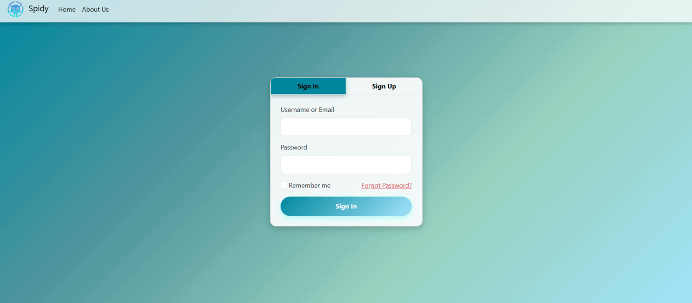

# Comprehensive Proctoring System with AI-Driven Automated Exam Management

An AI-powered online examination system that enhances the integrity, efficiency, and scalability of digital assessments. This system integrates advanced modules such as question generation, speech-to-text transcription, real-time AI-based proctoring, and automated answer evaluation.

## 🌐 Website Preview




## 👨‍💻 Team Members

- **Pranava Thejaswi N M** – 4VV21IS077  
- **Phaneesh M Joshi** – 4VV21IS071  
- **U J Krishna** – 4VV21IS111  
- **Samarth C** – 4VV21IS090  

**Guided by:** Dr. Gowrishankar B S, Assistant Professor, Dept. of ISE, VVCE

---

## 📌 Project Overview

This project addresses the increasing need for secure and scalable online examination solutions. It eliminates the limitations of traditional exams by integrating:

- AI-generated question sets from uploaded content
- Real-time proctoring with facial and gaze detection
- Speech-to-text transcription for oral exams
- AI-based answer evaluation and feedback

---

## 🎯 Objectives

- Develop an internet-based exam system with smart scheduling and delivery.
- Ensure integrity via AI-powered proctoring (face, gaze, and object detection).
- Automate question generation based on study material using Gemini API.
- Provide instant result generation and performance analysis.
- Enable adaptive testing with randomized and difficulty-based questions.
- Allow oral answer transcription using OpenAI Whisper.
- Scale to large numbers of users with Firebase backend and web hosting.

---

## 🚀 Features

- **AI-Generated Questions**: Automatically generate questions using the Gemini API based on uploaded study materials.
- **Real-Time Proctoring**: Monitor exams with facial recognition, gaze tracking, and object detection using YOLOv11 and MediaPipe.
- **Speech-to-Text Transcription**: Convert student speech to text using OpenAI's Whisper for oral exams.
- **Automated Answer Evaluation**: Assess answers using natural language processing techniques.
- **Secure Authentication**: Implement JWT/OAuth for secure user login.
---
## 🔧 Technologies Used

| Area             | Technologies/Tools                         |
|------------------|--------------------------------------------|
| Backend          | Python, Flask                              |
| Frontend         | HTML5, CSS3, JavaScript, React.js          |
| AI/ML Models     | Gemini API, Whisper, YOLOv11, MediaPipe    |
| Database         | Firebase, MySQL                            |
| Dev Tools        | Visual Studio Code, Git, Google Colab      |
| Hosting/Infra    | AWS / GCP                                  |

---


## 📁 Repository Structure

- `app.py`: Main application script.
- `templates/`: HTML templates for the frontend.
- `static/`: Static files like CSS and JavaScript.
- `requirements.txt`: Python dependencies.
- `Dockerfile`: Containerization setup.
- `.env`: Environment variables (ensure this is kept secure).
- `README.md`: Project documentation.

---

## 🖥️ System Requirements

- **OS:** Linux / Windows / macOS  
- **Python:** ≥ 3.8  
- **RAM:** ≥ 8 GB  
- **Disk Space:** ≥ 20 GB  
- **GPU:** Recommended for model training

---

## 💻 Hardware Requirements

| Component     | Recommended Specification                                     |
|---------------|---------------------------------------------------------------|
| CPU           | Intel Core i5 or higher                                       |
| RAM           | Minimum 8 GB                                                  |
| Disk Space    | At least 20 GB free (SSD preferred)                           |
| GPU           | Optional (Recommended for model training & Whisper accuracy) |
| Camera        | Functional webcam for proctoring                              |
| Microphone    | Required for speech-to-text input                             |

---

## ⚙️ Installation & Setup

### 1. Clone the repository

```bash
**Clone the repository**:

   ```bash
    git clone https://huggingface.co/spaces/spidyprocter/Spidy
    cd Spidy
    pip install -r requirements.txt
    python app.py
